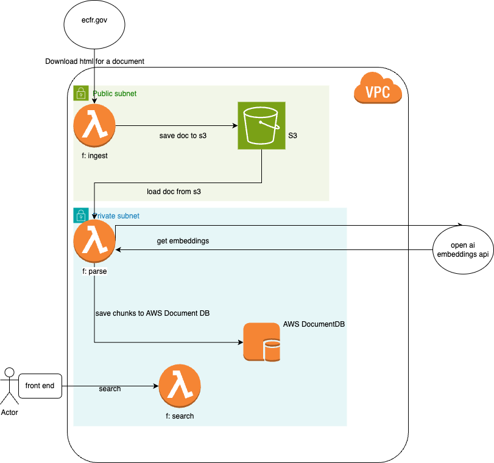

# ECFR Parse and Search

This repo uses serverless framework (aws cloud formation) to spin up all the resources necessary to download an ECFR doc (lambda), and then save its contents (AWS Document DB/S3). It then allows a user to search the contents of each document (lambda).

Note\*\* not all of the needed resources in AWS have been extracted into the serverless file yet.

## Technical Design

I used cheerio to parse and chunk the source html document, then generated embeddings for each chunk using open ai's embeddings api and saved those alongside the source in AWS Document DB. The search converts the user query to an embedding and does nearest neighbor vector comparison in the DB using AWS DocumentDBs vector search. The vector index was created off the embeddings field pulled from open ai, and I am returning top 5 results.
Specs

- Dimensions = 2000 (limit of 2k for vector index in AWS DocumentDB)
- model - open ai text-embedding-3-large
- chunk size <= 8k characters

AWS infrastructure is all deployed using serverless framework (AWS Cloud formation).

## 3 lambdas

1. ingest

- Downloads each regulation's html document directly from the source on ecfr.gov and saves it to S3.

2. parse

- Loads the regulation document from S3, parses it using cheerio into chunks, calls open ai's batch embeddings endpoint and then saves embedding and chunk to AWS DocumentDB

3. search

- public api that allows a user to pass in a query string and get the top five results

### Architecture Diagram



### Usage

GET - https://ctt7tukwd2.execute-api.us-east-1.amazonaws.com/dev/search<br/>
query parameters:<br/>
q = search text
i.e.

```
https://ctt7tukwd2.execute-api.us-east-1.amazonaws.com/dev/search?q=The Secretary of Transportation
```

## ToDos

- Pull remaining infrastructure out of AWS into the serverless file (only some of the infrastructure has been extracted already)
- Add back in embeddings and vector search. Ran into limitations around open ai's rate limits/costs so currently it is using AWS DocumentDB Text search
- Add UI to perform search, see documents that have been ingested, view results, etc.
- Optimize data model to be more normalized, and facilitate upserting rather than inserting when running pipeline.
- Possibly move the lambdas into a step function rather than the current flow which is triggering each function manually.
- Possibly authorizers around search
- Offline mode?
  - With react native this would involve probably downloading whichever specific documents (or parts of a document) were relative to the project and then chunking it and performing a text search on the phone. Could possibly utilitize a vector search or a local LLM depending on how good the search needs to be. The more we could trim down the document to only the relevant portions for what is downloaded, the better.
  - With react could possibly run some embedding models in a web client. But all of these offline approaches require at least an initial internet connection to download the content.
